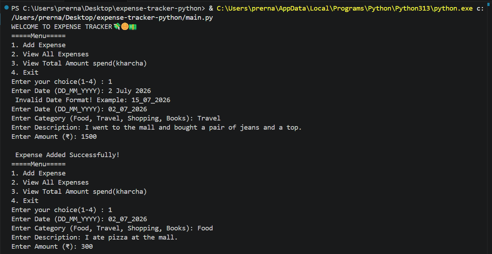
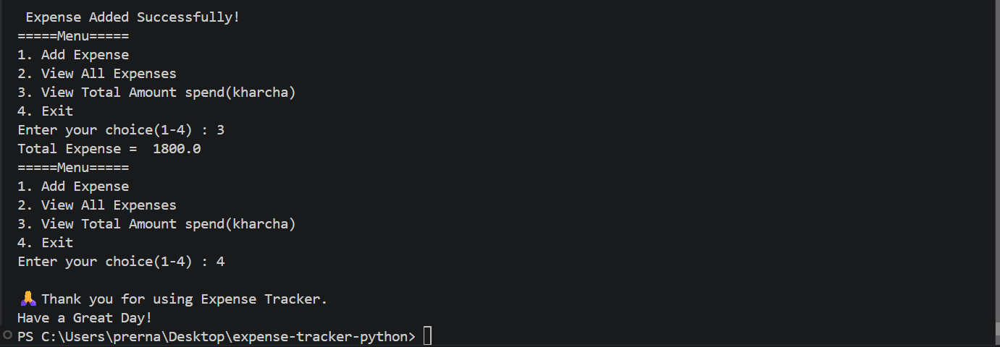

# 💰 Expense Tracker

A Python-based Expense Tracker developed to record, organize, and calculate daily expenses through a simple console interface.

This project was built as part of my Python learning journey to strengthen programming fundamentals, logical thinking, and data management skills by creating a real-world mini application.

---

## 📖 About the Project

Expense Tracker is a beginner-friendly Python application that allows users to manage their daily expenses efficiently.

Users can add expense details such as date, category, description, and amount. The application also calculates the total amount spent and displays all recorded expenses in a clean format.

The project focuses on writing clean, readable, and structured Python code while practicing fundamental programming concepts.

---

## ✨ Features

- ➕ Add new expenses
- 📅 Date validation
- 📂 Categorize expenses
- 📝 Add descriptions
- 💰 View total expenses
- 📋 Display all expenses
- ✅ Input validation
- 💻 User-friendly console interface

---

## 🛠 Technologies Used

- Python 3
- datetime Module

---

## 📚 Python Concepts Used

- Variables
- Lists
- Dictionaries
- User Input ('input()')
- Conditional Statements ('if', 'elif', 'else')
- Loops ('while', 'for')
- Exception Handling ('try-except')
- Date Validation ('datetime.strptime()')
- String Methods ('strip()')
- Type Casting
- Formatted Strings (f-strings)

---

## 📂 Project Structure

```text
expense-tracker-python
│
├── main.py
├── README.md
├── output1.png
└── output2.png
```

---

## ▶️ How to Run

1. Clone or download this repository.
2. Open the project in Visual Studio Code.
3. Run:

```bash
python main.py
```

4. Select an option from the menu.

```text
1 → Add Expense
2 → View All Expenses
3 → View Total Expense
4 → Exit
```

---

## 📸 Sample Output

### Home Screen



### Expense Details



---

## 📚 What I Learned

Through this project, I improved my understanding of:

- Working with Lists of Dictionaries
- Data organization
- Input validation
- Exception handling
- Date validation using datetime
- Loops and conditional statements
- Problem-solving using Python
- Writing clean and maintainable code

---

##  Future Improvements

- 💾 Save expenses to a file
- ✏ Edit existing expenses
- 🗑 Delete expenses
- 📊 Monthly expense reports
- 📈 Category-wise expense summary
- 🔍 Search expenses
- 🖥 GUI version using Tkinter
- 🗄 Database integration using SQLite

---

##  Author

Prerna Kadam

Computer Engineering Graduate

Python Learner | Aspiring Backend Developer
⭐ Thank you for visiting this repository. Feedback and suggestions are always welcome.
